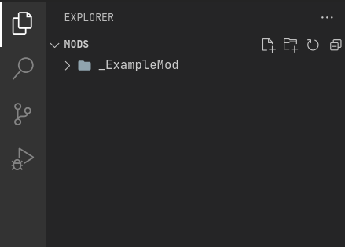
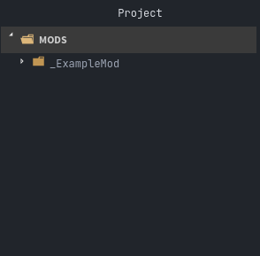
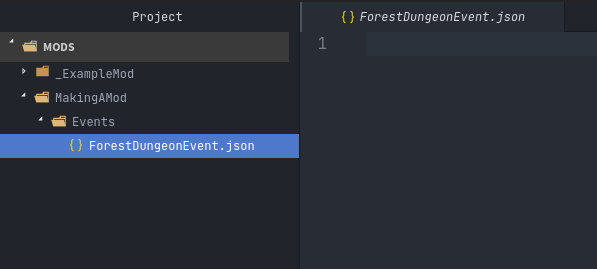
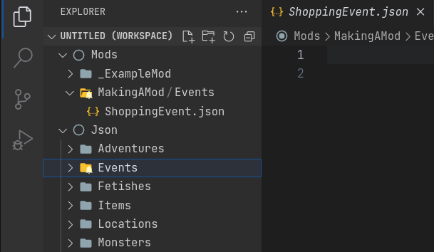
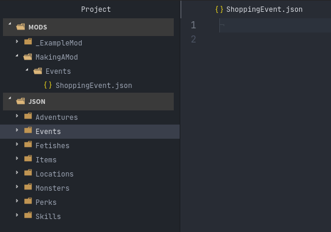

---
search:
  boost: 2
tags:
  - tutorial
  - begin
  - start
  - guide
---


# Making A Mod

In this brief step-by-step tutorial, you will make your first
proof-of-concept mod. By the end of the tutorial, you will have a simple
event you can interact with in the Shopping center of the Town.

You will be making mods in
precisely the same way Threshold makes content for the game:
creating text files in a minimal file format very close to writing in plain english.

Threshold intentionally designed it this way so he wouldn't have to think of
coding while making content, just directly writing dialogue and narration
with some predefined keywords to trigger various actions and checks.
You will not be reading or writing a single line of actual code.

## The Mods Folder

In order for the game to find and load your mod, it must be located in
the game folder titled `Mods`. See the instructions on where to locate
the Mods folder inside your given text editor:

=== "VS Code"

    **On Windows/Linux:**

    1. Go to File -> Add Folder To Workspace...
    2. Navigate to the base Monster Girl Dreams folder where you launch the
       game executable
    3. Click on `Mods`, click Select Folder.

    **On macOS:**

    1. Go to File -> Add Folder To Workspace...
    2. Go to Applications, right-click the MonGirlDreams application, and
       select "Show Package Contents".
    3. Navigate to `Contents/Resources/autorun/`, click the `Mods` folder,
       click Open.

    

=== "Pulsar"

    **On Windows/Linux:**

    1. Go to File -> Add Project Folder
    2. Navigate to the base Monster Girl Dreams folder where you launch the
       game executable,
    3. Click on `Mods`, click Select Folder.

    **On macOS:**

    1. Go to File -> Add Project Folder
    2. Go to Applications, right-click the MonGirlDreams application, and
       select "Show Package Contents".
    3. Navigate to `Contents/Resources/autorun/`, click the `Mods` folder,
       click Open.

    

=== "Notepad++"

    1. File creation and management is done outside of Notepad++, so open File Explorer.
    2. Open the base folder of Monster Girl Dreams, where you launch the
       game executable.
    3. Navigate to `\Mods\`.

    

You may have noticed the mod already present in the Mods folder, titled
`_ExampleMod`. This is an example mod by Threshold. It's currently
disabled because of the [underscore] in front of the
folder's name, preventing the game from loading the mod. To activate
the mod, right-click, rename, and remove the [underscore],
leaving it as `ExampleMod`. This is the equivalent and underlying
functionality for disabling and enabling a mod via the in-game Mods
menu.

!!! tip
    If you wanted to check ExampleMod in-game, you can find it at the
    Mountain, under Events in the Grimoire titled **Perpetua Returns!**

## Making Your Own

Right-click the Mods folder, create a new folder, and name it as you
please, such as `MakingAMod`.

Any files you place directly here will be ignored by the game. The game
will look inside your mod and check for specific folders titled any of
the following:

-   **Adventures**
-   **Events**
-   **Fetishes**
-   **Items**
-   **Locations**
-   **Monsters**
-   **Perks**
-   **Skills**

These folders are expected to contain files in a format called JSON,
which are just plain text files that can be opened and edited like any other.
The game on startup will load each JSON file in a certain way depending on
which one of the above folders the file is located in.

Since you will be adding an Event to the Shopping center, right-click
the folder of your mod and select the option to create a new folder.
Call it `Events`. The uppercase 'E' is important, as the game is case sensitive.
You do not need to add the other types of JSON folders listed above,
since you are not using them.

## Making an Event JSON

Right-click the Events folder, and make a file titled
`ShoppingEvent.json`. You could title it how you like, as long as it
ends with `.json`, else the file will not be loaded by the game.

At this point, your mod folder structure should look something like the
image below.



Double-click your file to open it. It should currently be empty.

The game expects the contents of a JSON file to follow specific
structural patterns. Typing it by hand is impractical, which is why you
can use the blank template provided by the base game files and
copy/paste its contents into `ShoppingEvent.json`. (Or type
`Create Event` and press enter via the VS Code MGD Language extension.)

To find it in your respective editor:

=== "VS Code"

    1. Go to *File* -\> *Add Folder To Workspace\...*
    2. Go back to the `game` folder, click on `Json`, click Select
        Folder/Open.
    3. In your workspace view, navigate within the Json folder to
        `Events/_BlankEvent.json`, and open the file.
    4. Select all file contents, `ctrl` / `⌘` + `c` to copy.
    5. Go to your `ShoppingEvent.json` tab, `ctrl` / `⌘` + `v` to paste.

    

=== "Pulsar"

    1. Go to *File* -\> *Add Project Folder*
    2. Go back to the `game` folder, click on `Json`, click Select
        Folder/Open.
    3. In your project view, navigate within the Json folder to
        `Events/_BlankEvent.json`, and open the file.
    4. Select all file contents, `ctrl` / `⌘` + `c` to copy.
    5. Go to your `ShoppingEvent.json` tab, `ctrl` / `⌘` + `v` to paste.

    


=== "Notepad++"

    1. Open File Explorer.
    2. Navigate to `game\Json\Events\_BlankEvent.json` open in Notepad++,
    3. Select all file contents, `ctrl+c` to copy.
    4. Go to your `ShoppingEvent.json` tab, `ctrl+v` to paste.


## Keys And Values

Notice how there's a particular way everything has been structured.

You thankfully don't have to understand precisely how the structure of
a JSON works. You can get by using the Linter from your text editor. It will warn you if something went
wrong with the files structure that would otherwise prevent the game
from loading.

But there are some general words you should know, so you can better
understand other parts of the modding documentation in the future.

First, let's start by examining the top of the file:

``` json
"name": "",
```

Every JSON file's structure has two sides, the **key** (`"name":`), and
the **value** (`""`).

You will only have to modify the **value** side of these structures
while modding. The **keys** side never needs their text modified.

Values will always be inside of **strings**. Strings are a pair of
double quotation marks `""`.

## Providing Values

This tutorial will proceed to give example values to fill your event
with, which will be an event in the shopping district of the Town
in-game.

Starting with the name key at the top of your file, provide it with a
value of `"Slimey Customer Encounter!"`. This is what will be displayed
to the Player when they go 'Shopping' in the Town. The value for a
name key in a new event should always be something unique in order to
avoid being mixed up with Events from the base game.

``` json
"name": "Slimey Shopping Encounter!",
"CardType": "",
"CardLimit": "",
"Description": "",
"requires": [""],
"requiresEvent": [
    {
        "NameOfEvent": "",
        "Progress": "99",
        "Choice": "",
        "ChoiceNumber": "-1"
    }
],
"Speakers": [
    {
        "name": "Blue Slime",
        "postName": "",
        "SpeakerType": ""
    }
],
```

In order for the game to know this event is meant to be included in the
Shopping section of the Town, we need to change the value of the
`"CardType":` key to `"Shopping"`.

Now, give `"CardLimit":` the value of `"0"`, as this key is unused for
CardTypes of Shopping, but still needs a numerical value for technical
reasons.

`"Description":` can be left empty, as it also isn't used by CardTypes
of Shopping.

`"requires":` and `"requiresEvent":` are capable of limiting Player
access to an Event depending on if they do or do not meet the conditions
given. These can also be skipped and left alone this time.

`"Speakers":` is unique, as its structure contains other keys. You will
only need to change the Speakers `"name":` key for this Event. Change
its value to `"Blue Slime"`, as this Monster will be used in this Event.

The result thus far should look like this:

``` json
"name": "Slimey Shopping Encounter!",
"CardType": "Shopping",
"CardLimit": "0",
"Description": "",
"requires": [""],
"requiresEvent": [
    {
        "NameOfEvent": "",
        "Progress": "99",
        "Choice": "",
        "ChoiceNumber": "-1"
    }
],
"Speakers": [
    {
        "name": "Blue Slime",
        "postName": "",
        "SpeakerType": ""
    }
],
```

## EventText

A majority of time making Events is spent inside the `"EventText":` key.
This is where most of the game's dialogue and narration takes place.

``` json
"EventText": [
    {
        "NameOfScene": "",
        "theScene": [
            ""
        ]
    }
]
```

Like the Speakers key, it contains a structure that holds other keys.
Notice the two curly brackets `{}` that surround the two keys it
contains. The structure between these curly brackets can be duplicated
in order to make more scenes, for as long as it stays within the square
brackets `[]` of EventText.

1. Place your cursor to the right of the closing curly bracket `}`.
2. Create a new line with the enter key.
3. Copy and paste the contents of the above curly brackets on the new
    line, giving two scenes. (Or type `Scene` and press enter via the VS
    Code MGD Language extension.)

It should look like this:

``` json
"EventText": [
    {
        "NameOfScene": "",
        "theScene": [
            ""
        ]
    }
    {
        "NameOfScene": "",
        "theScene": [
            ""
        ]
    }
]
```

If you're using a Linter, you should be
noticing a red dot, indicating an error. This is because this breaks how
a JSON file is supposed to be structured. If you were to try to launch
the game, this would cause it to crash, as it wouldn't be able to
understand the file.

To fix this, place a comma `,` at the end of the first pair of curly
brackets. This will tell the game that it's safe to move to the next
scene when it reads the file.

It should look like this:

``` json
"EventText": [
    {
        "NameOfScene": "",
        "theScene": [
            ""
        ]
    },
    {
        "NameOfScene": "",
        "theScene": [
            ""
        ]
    }
]
```

## NameOfScene & theScene
It's time to truly start writing the scenes for the Event.

`"NameOfScene":` is the title of the scene that the game will use to
identify where it needs to go in the Event. The first scene listed
towards the top of the file will play first by default when Players
enter an Event. You can title it `"EventStart"` for this reason.

`"theScene":` is where the actual content is written. By default, any
value you provide will be the narration that's displayed to the player
in-game. Provide a value of `"You walk around the shops."`

Of course, to make a new scene for every line of dialogue would be
impractical. Thankfully, you won't need to.

Notice how theScene has the same structure as the EventText key, the
square brackets `[]`. This is called an **array**.

Just like how arrays enable EventText to have multiple scene structures,
arrays allow for theScene to contain multiple values.

To do this, put a comma at the end of the current value, and provide
another string in the form of two double quotation marks, like so:

``` json
"theScene": [
    "You walk around the shops.", ""
]
```

For organization's sake, you can press enter in between the two values
to cause a linebreak and put them on separate lines.

``` json
"theScene": [
    "You walk around the shops.",
    ""
]
```

This process can be repeated any number of times till the scene is
considered done.

## Functions

Currently, the Event lacks logic that tells the game to do special
actions, such as display characters, have the Player talk, or start a
combat encounter.

This is done inside scenes by providing 'magic words' inside the
strings that the game will recognize as a request to do something. These
are called **functions**. Threshold designed these to sound like plain
English words for ease of understanding.

We'll first display the Blue Slime from the Speakers key. This can be
done using the `"DisplayCharacters"` keyword. This requires additional
string values thereafter to say which characters Speakers key you wish
to display, by the order they are listed.

Since it's just the Blue Slime, it would be the string value of `"1"`.
To tell the game it doesn't need to display any more characters, you
end the DisplayCharacters function with the string value `"EndLoop"`.

``` json
"theScene": [
    "You walk around the shops.",
    "DisplayCharacters",
        "1",
    "EndLoop"
]
```

Next, use the function `"Speaks"` to have the Blue Slime talk, which
will cause the next string value to be spoken by the Blue Slime.

Provide a value of
`"Hello [ThePlayerName], I am Blue Slime, let's fight."`. Notice the use
of `[ThePlayerName]` inside of the string value. This is known as
[Markup](../Reference/Markup.md), which
changes `[ThePlayerName]` to the name set by the Player when experienced
in-game.

``` json
"theScene": [
    "You walk around the shops.",
    "DisplayCharacters",
        "1",
    "EndLoop",
    "Speaks",
        "Hello [ThePlayerName], I am Blue Slime, let's fight.",
]
```

The last part of this scene will start a fight with the function
`"CombatEncounter"`. Will check the following string values for what and
how many monsters to include based on what they're called. Provide a
value of `"Blue Slime"`. You end the function and start the fight with
the keyword `"StartCombat"`.

Provided the player wins and isn't sent back to Church, the scene will
continue playing. Provide the string value `"You continue shopping."`

``` json
"theScene": [
    "You walk around the shops.",
    "DisplayCharacters",
        "1",
    "EndLoop",
    "Speaks",
        "Hello [ThePlayerName], I am Blue Slime, let's fight.",
    "CombatEncounter",
        "Blue Slime",
    "StartCombat",
    "You continue shopping."
]
```

!!! info "See also"

    For learning of other functions, see the
    [functions reference](../Functions/index.md). To see them in use, be sure to check the examples on their
    pages, other mods, or the base games Events folder itself.

## Jumping Scenes
By default, the game doesn't know how to jump to additional scenes in
the EventText key. It has to be manually done with functions.

Finish the EvenStart scene with the string value of the function
`"JumpToScene"`. Finish the scene with the string value of the scene you
wish to jump to. In this case, it will be `"Find Ugli Herb"`

You can now move on to the next scene. Change its NameOfScene value to
the same value you gave the JumpToScene function in the previous scene,
`"Find Ugli Herb"`.

``` json
"EventText": [
    {
        "NameOfScene": "EventStart",
        "theScene": [
            "You walk around the shops.",
            "DisplayCharacters",
                "1",
            "EndLoop",
            "Speaks",
                "Hello [ThePlayerName], I am Blue Slime, let's fight.",
            "CombatEncounter",
                "Blue Slime",
            "StartCombat",
            "You continue shopping.",
            "JumpToScene", "Find Ugli Herb"
        ]
    },
    {
        "NameOfScene": "Find Ugli Herb",
        "theScene": [
            ""
        ]
    }
]
```

Lastly, you can provide theScene with the following string values:

``` json
"theScene": [
    "{b}Wow{/b}, you found an Ugli Herb!",
    "GiveItemQuietly", "1", "Ugli Herb"
]
```

The markup `{b}` **and** `{/b}` boldens the text of anything between
them. `"GiveItemQuietly"` provides the given value amount of the
specified item.

## Conclusion

You have made a functional mod, which adds an Event that you can now play
in-game.

!!! note

    When testing your mod, you may notice that successfully running away
    from the Blue Slime will cause the entire Event to end early!

    Researching seemingly unexpected behavior like this is a standard
    practice you'll often have to do while modding. If you're curious, see
    if you can identify the reason why this happens on the
    Pre-Combat function reference page.
