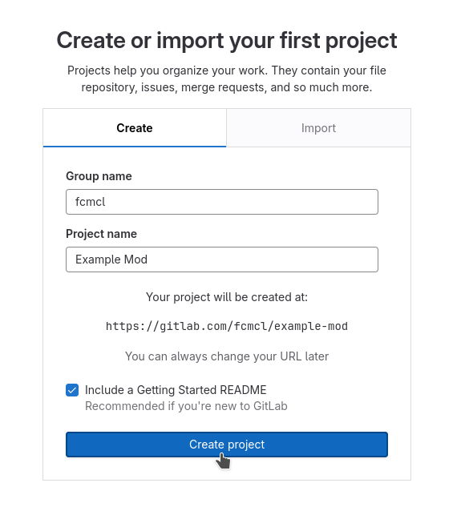
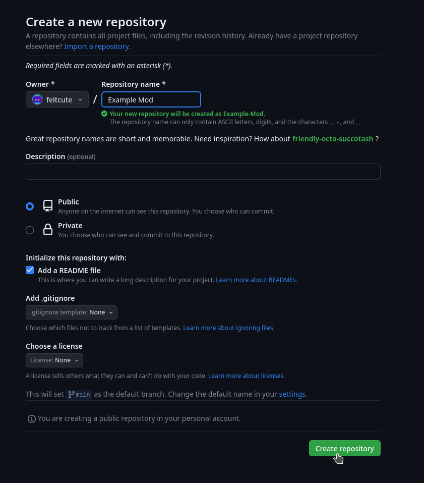
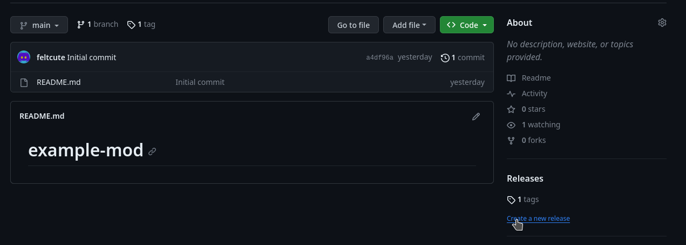
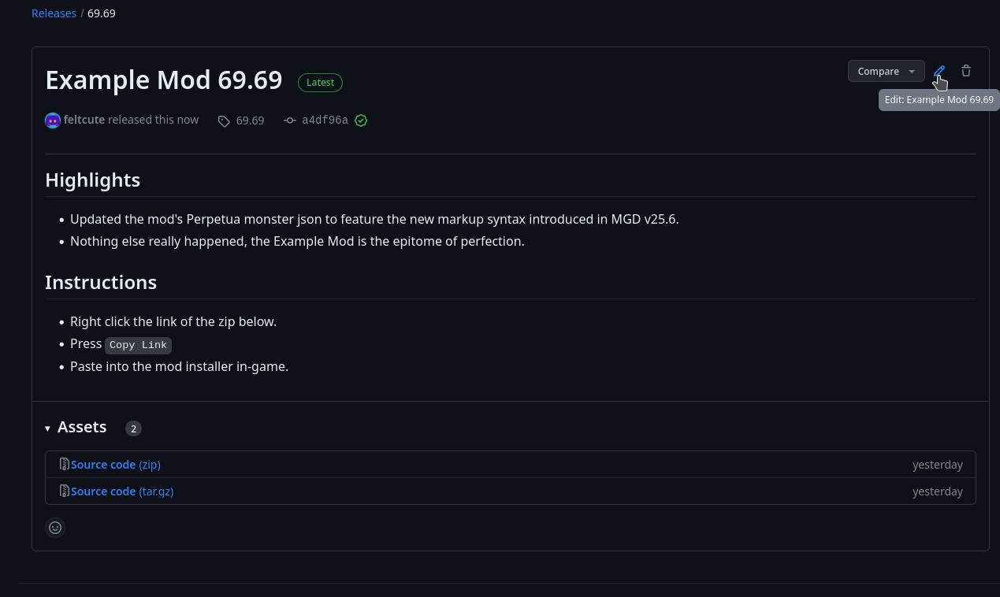
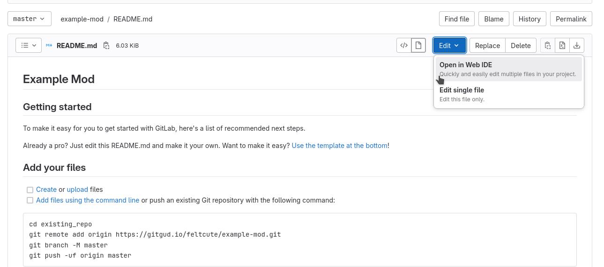
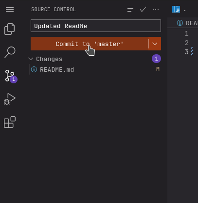
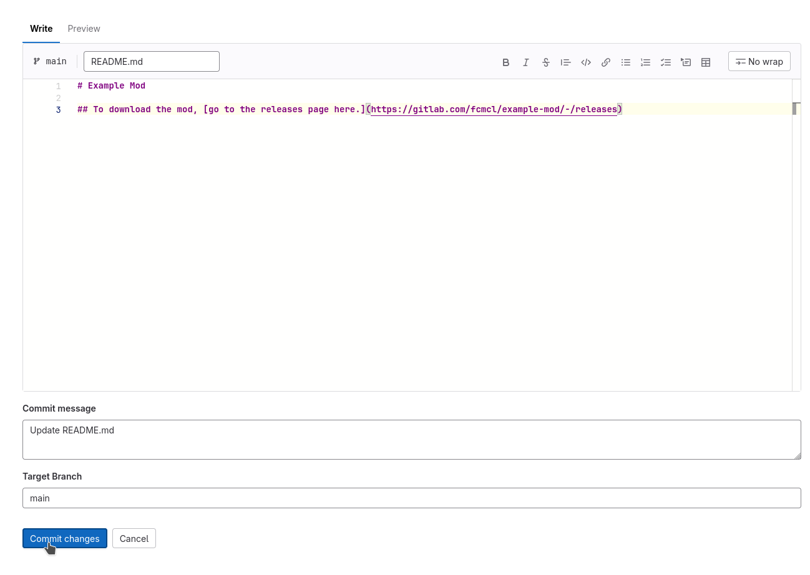

---
tags:
  - release
  - publish
  - post
---

# File Hosting Your Mod
This page will cover how to use Github, Gitlab, and Gitgud as a zip file
host for your mod, **without having to use git.**

To begin, make an account on your platform of choice:

-   [Gitgud](https://gitgud.io) has no restrictions on NSFW content, and
    has many of their top repositories as examples, though smaller and
    less proven than the alternative hosts.
-   [Gitlab](https://gitlab.com/explore/projects) is a larger platform
    than Gitgud with the same interface, but has the open risk of less
    permissive [use
    policies](https://about.gitlab.com/handbook/legal/policies/website-terms-of-use/).
-   [Github](https://github.com/) is the largest platform. While
    historically fairly permissive of various NSFW projects, keep in
    mind their [use
    policies](https://docs.github.com/en/github/site-policy/github-acceptable-use-policies).
    **It also requires 2-factor authentication to use.**

Then use the respective tab for your chosen platform to create a new
repository for your mod:

=== "Gitgud"

    1. [Create a project.](https://gitgud.io/projects/new#blank_project)
    2. Follow the prompts for naming, initializing a README, and making it
        Public:

    

    3. Press `Create Project`

=== "Gitlab"

    1. [Create a project.](https://gitlab.com/projects/new)
    2. Follow the prompts for naming, initializing a README, and making it
        Public:

    

    3. Press `Create Project`

=== "Github"

    1. [Create a project.](https://github.com/new)
    2. Follow the prompts for naming, initializing a README, and making it
        Public:

    

    3. Press `Create Rrepository`

After creating your repo, create a release:

=== "Gitgud"

    1. Pin the releases section.

    

    2. Enter the releases section.

    

    3. Create a new Release.

    

=== "Gitlab"

    1. Click past all the prompts. Pin the releases section.

    

    2. Enter the releases section.

    

    3. Create a new Release.

    

=== "Github"

    1. Create a new Release.

    

On the release creation page, fill in its contents accordingly:

=== "Gitgud"

    1. Add and create a `Tag name` equivalent to the version number of your
        release.

    

    

    2. In `Release Title`, provide the name of your mod along with the
        version number.
    3. In `Release notes`, use
        [markdown](https://support.discord.com/hc/en-us/articles/210298617-Markdown-Text-101-Chat-Formatting-Bold-Italic-Underline-)
        to provide a brief and eye-catching summary of the update. Make
        sparing use of bold words to help visually prioritize points of your
        release.

    ``` markdown
    ## Highlights
    - Updated the mod's Perpetua monster json to feature the new markup syntax introduced in MGD v25.6.
    - Nothing else really happened, the Example Mod is the epitome of perfection.

    ## Instructions
    - Right-click the link of the zip below.
    - Press `Copy Link`
    - Paste into the mod installer in-game.
    ```

    !!! tip

        You can copy/paste the same relevant markdown contents of your release
        notes here and for your post on the MGD Discord, as the formatting is
        the same.

    4. While at the bottom of your `Release notes`, attach the zip file of
        your mod by clicking the paperclick icon in the bar above.

    

    5. Ensure the link is prepended with a `#` to make it a header,
        ensuring it is as big and noticeable as possible.

    

    6. Press `Create Release` at the bottom.

    !!! tip

        If at any point you make a mistake or want to change something, you can
        always edit the post via the pencil icon in the top right.

        

=== "Gitlab"

    1. Add and create a `Tag name` equivalent to the version number of your
        release.

    

    

    2. In `Release Title`, provide the name of your mod along with the
        version number.
    3. In `Release notes`, use
        [markdown](https://support.discord.com/hc/en-us/articles/210298617-Markdown-Text-101-Chat-Formatting-Bold-Italic-Underline-)
        to provide a brief and eye-catching summary of the update. Make
        sparing use of bold words to help visually prioritize points of your
        release.

    ``` markdown
    ## Highlights
    - Updated the mod's Perpetua monster json to feature the new markup syntax introduced in MGD v25.6.
    - Nothing else really happened, the Example Mod is the epitome of perfection.

    ## Instructions
    - Right-click the link of the zip below.
    - Press `Copy Link`
    - Paste into the mod installer in-game.
    ```

    !!! tip

        You can copy/paste the same relevant markdown contents of your release
        notes here and for your post on the MGD Discord, as the formatting is
        the same.

    4. While at the bottom of your `Release notes`, attach the zip file of
        your mod by clicking the paperclick icon in the bar above.

    

    5. Ensure the link is prepended with a `#` to make it a header,
        ensuring it is as big and noticeable as possible.

    

    6. Press `Create Release` at the bottom.

    !!! tip

        If at any point you make a mistake or want to change something, you can
        always edit the post via the pencil icon in the top right.

        

=== "Github"

    1. Press `Choose a tag` and give an equivalent to the version number of
        your release.

    

    2. In `Release title`, provide the name of your mod along with the
        version number.
    3. In `Describe this release`, use
        [markdown](https://support.discord.com/hc/en-us/articles/210298617-Markdown-Text-101-Chat-Formatting-Bold-Italic-Underline-)
        to provide a brief and eye-catching summary of the update. Make
        sparing use of bold words to help visually prioritize points of your
        release.

    ``` markdown
    ## Highlights
    - Updated the mod's Perpetua monster json to feature the new markup syntax introduced in MGD v25.6.
    - Nothing else really happened, the Example Mod is the epitome of perfection.

    ## Instructions
    - Right-click the link of the zip below.
    - Press `Copy Link`
    - Paste into the mod installer in-game.
    ```

    !!! tip

        You can copy/paste the same relevant markdown contents of your release
        notes here and for your post on the MGD Discord, as the formatting is
        the same.

    4. Attach your zip via the "Attach binaries" button towards the
        bottom.

    

    5. Press `Create Release` at the bottom.

    

    !!! tip

        If at any point you make a mistake or want to change something, you can
        always edit the post via the pencil icon in the top right.

        

Lastly, to help prevent people from getting lost on the homepage of your
repo:

=== "Gitgud"

    1. Click on your README File.

    

    2. Click `Edit` and then `Open in Web IDE` to change its contents.

    

    3. Delete all of its contents and use this template to promptly direct
        the user to the Releases page of your repository (Ensure it does not
        lead to a specific release):

    ``` markdown
    # <Mod Title Here>

    ## To download the mod, [go to the releases page here.](<Paste releases page link here>)
    ```

    

    4. Publish the changes to your repository by going to `Source Control`,
        writing a description of the change, and pressing
        `Commit to 'master'`. On the prompt, press `Continue`.

    

    5. Press the `Go to Project` prompt at the button on the bottom right
        and review your changes.

=== "Gitlab"

    1. Click on your README File.

    

    2. Click `Edit` and then `Edit single file` to change its contents.

    

    3. Delete all of its contents and use this template to promptly direct
        the user to the Releases page of your repository (Ensure it does not
        lead to a specific release):

    ``` markdown
    # <Mod Title Here>

    ## To download the mod, [go to the releases page here.](<Paste releases page link here>)
    ```

    4. Publish the changes to your repository by going to `Source Control`,
        writing a description of the change, and pressing
        `Commit to 'master'`. On the prompt, press `Continue`.

    

=== "Github"

    1. On the homepage, click the pencil icon at the top right of the
        README.

    

    2. Delete all of its contents and use this template to promptly direct
        the user to the Releases page of your repository (Ensure it does not
        lead to a specific release):

    ``` markdown
    # <Mod Title Here>

    ## To download the mod, [go to the releases page here.](<Paste releases page link here>)
    ```

    3. Publish the changes to your repository via `Commit Changes` on the
        top right. Press `Commit changes` again.

    

Now that your mod is published, you can proceed with
[reading information on where to optimally share it](../GettingStarted/PublishingMods.md).
